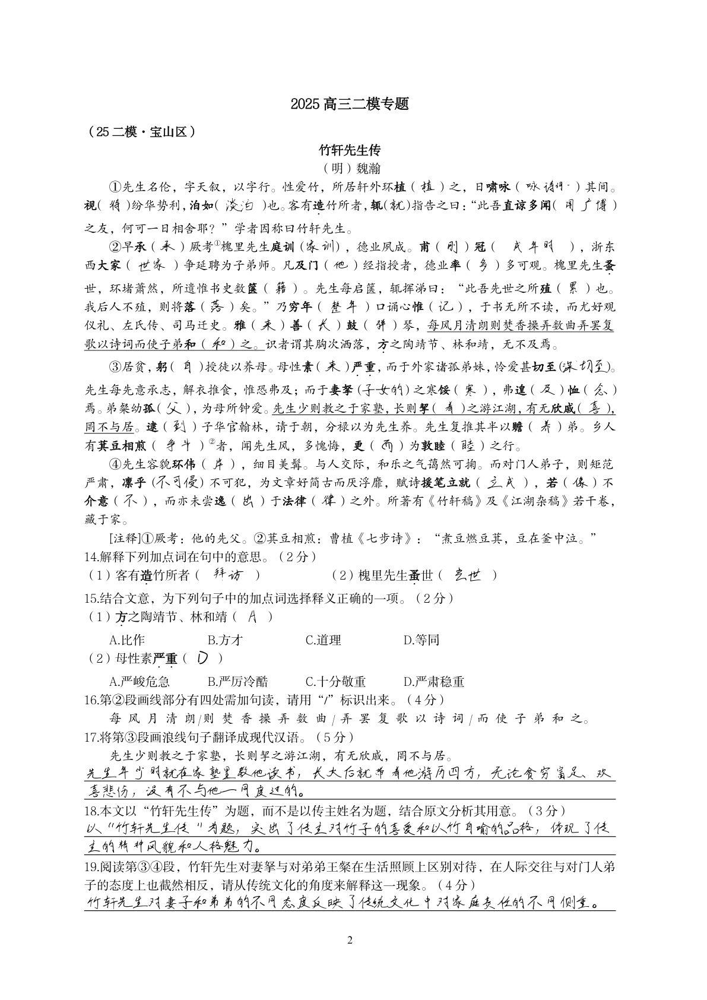
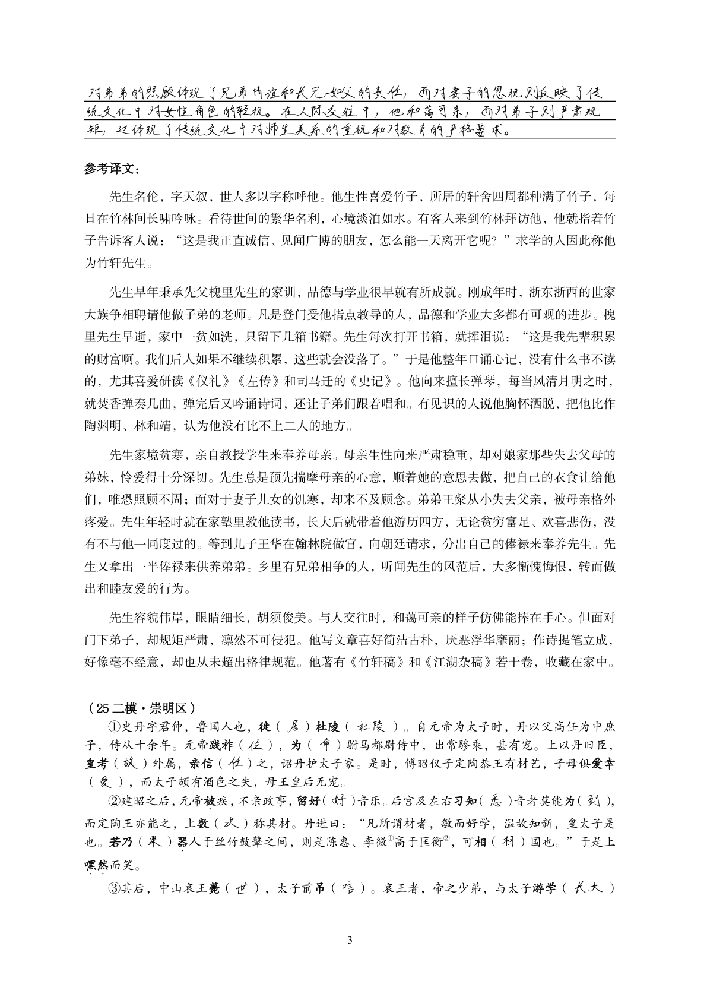
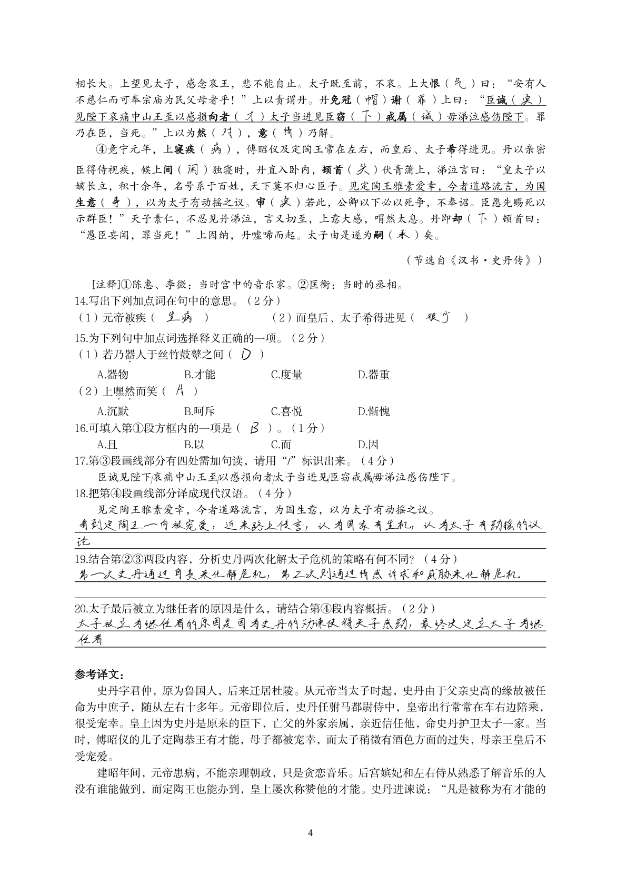

# God · 高中语文作业代笔工具

[](https://www.python.org/)
[](LICENSE)

针对高中语文笔头作业过多，来不及抄写的情况。上传一份作业（PDF / Word / 照片都行），程序找出里面的空位、用大模型填好答案，再用自己的手写字体把答案写回去，生成一份可以直接打印交差的 PDF。（只适配高中语文或类似题型的作业，否则效果不大好）

下面是一份高三文言文卷子的实际效果（共 3 页）：







## 它具体做什么

1. 读入作业。PDF 直接读文本层；Word 先转成 PDF；照片只能 OCR。
2. 从文本里找出所有要填的地方（下划线、括号、方框、答题区都算），按顺序编号，把整篇文章连同编号发给大模型。
3. 大模型按编号返回答案。卷子太长会自动按文章分批发送，不会超字数。
4. 答案先存成 JSON，可以人工改一遍再渲染。
5. 用手写字体把答案写回空位：每个字带一点随机的旋转、偏移和墨色变化，尽量像真人写的。一道题答案太长、空位装不下时，多出的部分用小一号字写在横线下面。

支持的题型基本就是高中语文卷子那些：填空、选择、默写、翻译、简答、文言文断句之类。

## 安装

```bash
git clone https://github.com/hhhhbrll/Godissac.git
cd Godissac
pip install -r requirements.txt -i https://mirrors.aliyun.com/pypi/simple/
```

需要 Python 3.10 以上。Word 转 PDF 依赖 LibreOffice 或微软 Word，没有的话直接用 PDF 输入即可。

## 配置 API Key

复制 `.env.example` 为 `.env`，填一个能用的 Key 就行：

```ini
DASHSCOPE_API_KEY=sk-xxx
```

注：模型智商直接决定了生成质量。但国内主流大模型其实也凑活能用，交差足够。

## 运行

```bash
python god_app.py            # 交互式菜单

python god.py homework 作业.pdf   # 识别+作答，停下来等你核对
python god.py auto 作业.pdf       # 一路跑完不核对
python god.py render              # 改完答案后重新渲染
```

作答用的提示词在 `config/prompt.txt`，可以直接改。每次作业的结果单独放在 `output/runs/作业名_时间戳/` 下，里面有完成版 PDF、透明答案层和答案 JSON。

## 关于手写字体

仓库里带的字体（`assets/fonts/myhand_full.ttf`）是我个人的字，公开在这里主要是为了演示效果。

想制作自己的ttf字体包，流程推荐：

1. `python tools/font_cli.py guide` 看完整流程；
2. 程序生成田字格采集表，自己手写 300~1000 个字（含标点、数字、字母）(有点点麻烦，不过一劳永逸就是了，但是这个手写体制作方式其实很额一般）；
3. 拍照上传，程序负责切格、矢量化；
4. 剩下几千个常见字靠 FontDiffuser 做风格迁移补全；
5. 合成为一个 TTF，之后做作业都用它。

个别 AI 补的字跟真迹风格不像，可以单独手写字补录替换。`fonts/` 里放了霞鹜文楷兜底，也能正常出图。

## 项目结构

```
Godissac/
├── god.py / god_app.py          # 命令行入口 / 交互式菜单
├── src/
│   ├── recognize/               # 空位提取、分批、调用模型、OCR
│   ├── render/                  # 手写渲染、逐字扰动、排版
│   └── fontforge_lib/           # 字体生产：切格、矢量化、合并
├── tools/                       # 字体相关工具脚本（font_cli.py 等）
├── config/prompt.txt            # 作答提示词
├── assets/                      # 演示 PDF、预览图、字体
└── samples/                     # 字符清单和示例作业
```

## 已知的不足

- 拍照的效果不如扫描件，尽量扫描后再上传；
- OCR 重建出来的文本层偶尔会认错字，空位定位也不如原生 PDF 准；
- 大模型给的答案不是全对；
- AI 补的字有少数和真迹不像，需要人工补。
- 还有一大堆bug，但还是那句话：应付长假作业足够了，打印出来你再自己涂涂

## 免责声明

如若被语文老师看出并单杀，概不负责。

## License

- 代码：[MIT](LICENSE)
- 兜底字体 [霞鹜文楷 LXGW WenKai](https://github.com/lxgw/LxgwWenKai)：SIL OFL 1.1
