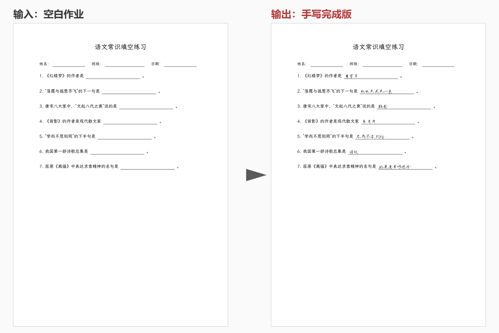

# God · 作业手写誊写引擎

[](https://www.python.org/)
[](LICENSE)
[](assets/fonts/)

上传一份作业，AI 自动识别所有空位并作答，再用**你自己的手写字体**把答案誊写到对应位置——输出一份可直接打印的「亲笔完成版」PDF。



> 上：输入的空白作业　下：输出的手写完成版（完整效果见 [`assets/demo_完成版.pdf`](assets/demo_完成版.pdf)）

---

## 功能特性

- **多格式输入**：PDF（最佳，文本层空位坐标 100% 精准）/ Word（自动转 PDF）/ 图片与图片文件夹（OCR 重建文本层后走同一管线）
- **全题型覆盖**：填空、选择、默写、词语解释、排序、简答、翻译、文言文句读断句
- **M9 文本优先架构**：从 PDF 文本层提取空位坐标并重建全文嵌入 `【N】` 标记，交文本 LLM 按编号作答——坐标与作答彻底解耦，对齐率 100%
- **大卷自动分批**：按「篇章」智能切分喂给 LLM（跨页文章字符级精准切分），几十页的大卷不会超模型输入上限
- **个人手写字体**：写 300~1000 字真迹，经矢量化 + 云端风格迁移（FontDiffuser）补全至 9900+ 字，覆盖常用汉字与标点/数字/字母
- **拟真渲染**：逐字扰动（旋转/基线/字号/字距随机微扰 + 墨色深浅抖动）；超容量答案按学生习惯在横线下方小一号补写；句读斜杠插在原文行内
- **多后端 API**：阿里百炼 / 中转站（OpenAI 兼容）/ 智谱任选，只配任意一家即可运行，跨厂自动回退
- **产物隔离**：每次作业独立存放于 `output/runs/作业名_时间戳/`，含完成版、透明答案层、可人工核对的 JSON

## 工作原理

```
作业文件 (PDF/Word/图片)
   │  归一化（图片→OCR→重建文本层PDF）
   ▼
文本层空位提取 (text_extract.py)      ← 空位坐标 + 上下文
   ▼
全文重建：嵌入【N】标记 (marked_text)
   ▼
按篇章分批 (article_split.py)
   ▼
文本 LLM 按编号作答 (text_llm.py)     ← 空答案自动补答 / 超容量答案压缩
   ▼
人工核对 (m2_review.json，可改)
   ▼
手写渲染 (renderer.py + perturb.py)   ← 个人字体 + 逐字扰动 + 贴线排版
   ▼
完成版 PDF + 透明答案层 PDF
```

字体生产线（独立于做作业主线）：

```
采集表生成 → 手写真迹(300~1000字) → 切格/矢量化/合并
   → 云端 FontDiffuser 风格迁移补全 8000+ 字 → 笔宽归一/污迹清理/标点排版
   → myhand_full.ttf
```

## 快速开始

### 安装

```bash
git clone https://github.com/issac15216866223-coder/God.git
cd God
pip install -r requirements.txt -i https://mirrors.aliyun.com/pypi/simple/
```

依赖：Python 3.10+，PyMuPDF / OpenCV / fontTools / potracer / DashScope SDK 等（见 `requirements.txt`）。

### 配置 API Key

复制 `.env.example` 为 `.env`，填入任意一家的 Key：

```ini
DASHSCOPE_API_KEY=sk-xxx        # 阿里百炼（免费申领）——最简方式
# 或者中转站 / 智谱，详见使用说明
```

### 运行

```bash
# 交互式菜单（做作业 / 渲染 / 字体管理 / API 设置 / 渲染风格）
python god_app.py

# 或命令行直通
python god.py homework 作业.pdf   # 识别作答（停下等人工核对）
python god.py auto 作业.pdf       # 全自动（不核对）
python god.py render              # 用核对后的答案重新渲染
```

## 训练你自己的手写字体

1. `python tools/font_cli.py guide` 查看全流程向导
2. 程序生成田字格采集表（带锚点定位 + 灰色提示字）
3. 黑色签字笔书写 300（极速版）或 1000+ 字（含标点/数字/字母）
4. 拍照 → 程序自动切格、矢量化、合并真迹
5. （推荐）云端风格迁移补全至 9900+ 字：AutoDL 租 4090，上传包一键生成，跑完自动关机（约 1~1.5 小时，费用 2~5 元）
6. 导入结果，得到 `myhand_full.ttf`——之后所有作业都用它渲染

不想训练？`fonts/` 内置文楷楷体兜底，或把别人训练好的 TTF 放进 `fonts_user/` 直接使用。

## 项目结构

```
God/
├── god.py / god_app.py        # CLI 入口 / 交互式菜单
├── src/
│   ├── recognize/             # 识别与作答：空位提取、篇章分批、LLM 客户端、
│   │                          #   OCR 重建、格式归一化
│   └── render/                # 渲染引擎：手写渲染器、逐字扰动、答案排版
├── tools/
│   ├── font_cli.py            # 字库全生命周期 CLI（11 个子命令）
│   └── merge_*/fix_*/...      # 字体合并、碎字修复、污迹清理、标点排版等
├── src/fontforge_lib/         # 字体生产：切格、矢量化、字形合并、质检
├── config/prompt.txt          # LLM 作答提示词（可自定义）
├── assets/                    # 演示产物与字体样例
└── samples/                   # 字符清单、演示作业
```

## 已知边界

- 拍摄照片识别效果不如扫描件/PDF（已内置 OCR 管线，但建议自行扫描后上传）
- 生成字风格迁移效果因人而异，个别字需人工补录（`font_cli.py` 提供单字补录闭环）
- LLM 答案准确率约 90~95%，语文默写/数学计算建议人工核对后再渲染

## 免责声明

本项目是**手写字体复刻与文档自动誊写的技术探索**，仅供个人学习与研究使用。使用者需自行遵守所在学校/机构关于作业提交的规定，并对生成内容的使用负责。项目不对任何滥用行为承担责任。

## License

- 本项目代码：[MIT](LICENSE)
- 内置兜底字体 [霞鹜文楷 LXGW WenKai](https://github.com/lxgw/LxgwWenKai)：[SIL OFL 1.1](https://openfontlicense.org/)
